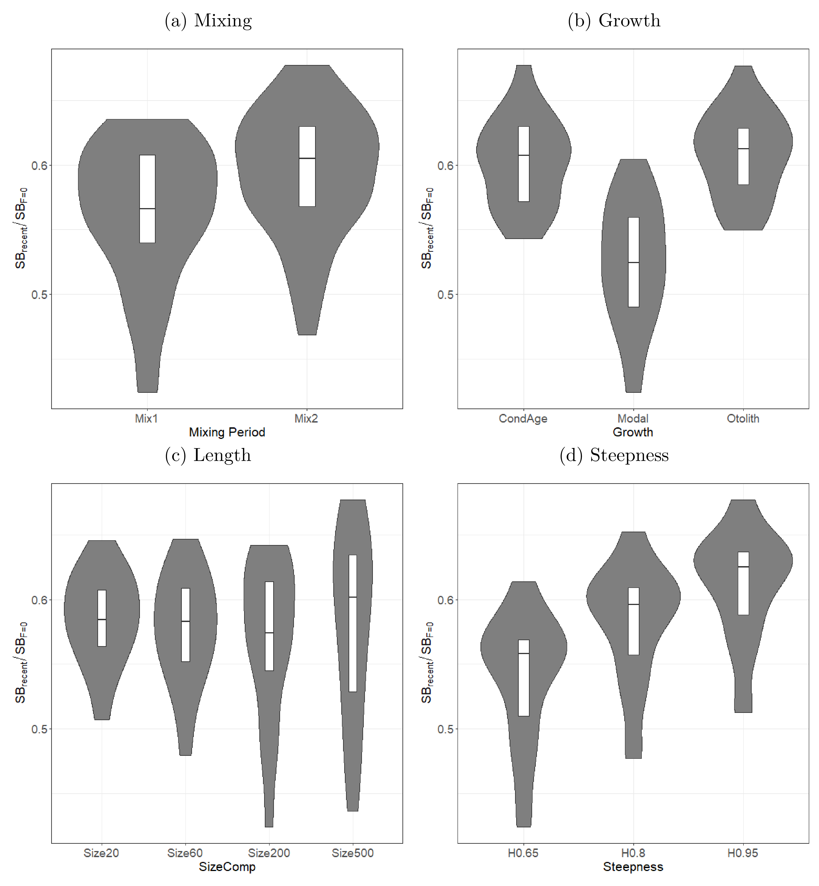

# Uncertainty Grid

## 2020

### BET

Axis                     | Levels | Option
------------------------ | ------ | -------------------------------------------
Steepness                |      3 | 0.65, 0.80* or 0.95
Natural mortality        |      2 | Diagnostic* or M-hi
Size frequency weighting |      4 | sample sizes divided by 20*, 60, 200 or 500

3 * 2 * 4 = 24

### YFT

Axis                     | Levels | Option
------------------------ | ------ | -----------------------------------------------------
Steepness                |      3 | 0.65, 0.80*, or 0.95
Growth                   |      3 | Modal estimate, External otolith, Cond age-at-length*
Size frequency weighting |      4 | sample sizes divided by 20, 60*, 200, or 500
Tag mixing               |      2 | 1 quarter, 2 quarters*

3 * 3 * 4 * 2 = 72

## 2023

### List of possible grid axes

Axis                     | Levels | Option
------------------------ | ------ | -----------------------------------------------------
Steepness                |      3 | 0.65, 0.80*, 0.95
Tag mixing               |      3 | 1, 2*, 3 quarters
Size data weighting      |      3 | Sample sizes divided by 10, 20*, 40
Tagging data weighting   |      3 | tau 1, 2*, 4 (-10, 0, and a value equivalent to tau 4)
Age data weighting       |      3 | 0.5, 0.75*, 1

3 * 3 * 3 * 3 * 3 = 243

## Figures from 2020

### BET

Figure 36: Estimated depletion (SB/SBF=0) for each of the axes in the structural
uncertainty grid: (a) data-weighting, (b) natural mortality, and (c) steepness.
The median SBlatest/SBF=0 and 80th percentile for each axis level are shown on
the right.

### YFT

Figure 51: Box and violin plots summarizing the estimated SBrecent/SBF=0 for
each of the models in the structural uncertainty grid. The line in the box is
the median of the estimates, while the box shows the 50th percentile. The shaded
area shows the probability distribution (or density) of the estimates of all
models across the axes of the structural uncertainty grid.

